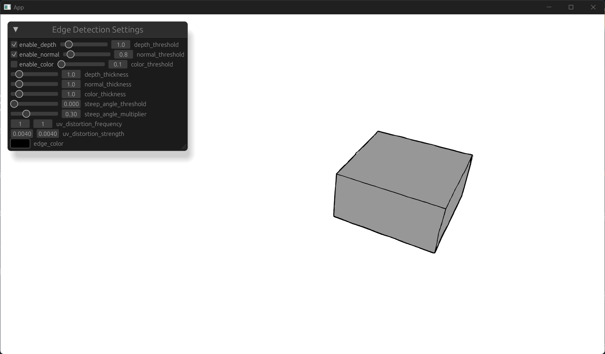
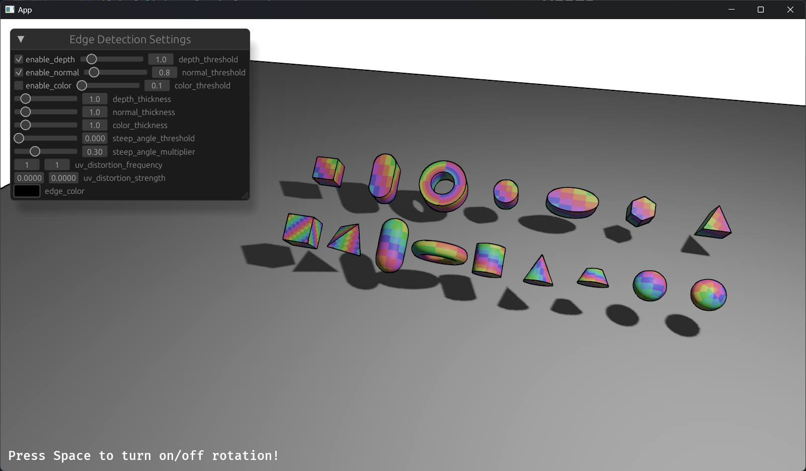

# bevy_edge_detection

`bevy_edge_detection` is a Bevy plugin that provides edge detection post-processing using a 3x3 Sobel filter. This plugin is designed to enhance your Bevy projects by adding visually distinct edges to your 3D scenes, making them more stylized or easier to analyze.





## Usage

0. Add bevy_edge_detection to your Cargo.toml:

```rust
[dependencies]
bevy_edge_detection = "0.15.5"
```

1. Add the EdgeDetectionPlugin to your Bevy app:

```rust
use bevy::prelude::*;
use bevy_edge_detection::EdgeDetectionPlugin;

fn main() {
    App::new()
        .add_plugins(DefaultPlugins)
        .add_plugin(EdgeDetectionPlugin::default())
        .run();
}
```

2. Add `EdgeDetection` to `Camera`:

```rust
commands.spawn((
    Camera3d::default(),
    Transform::default(),
    EdgeDetection::default(),
));
```

## Example

```rust
cargo run --example 3d_shapes
```

## License

This project is licensed under the [MIT License](./LICENSE).

## Acknowledgments

Thanks to [IceSentry](https://github.com/IceSentry), this project was inspired by [bevy_mod_edge_detection](https://github.com/IceSentry/bevy_mod_edge_detection).